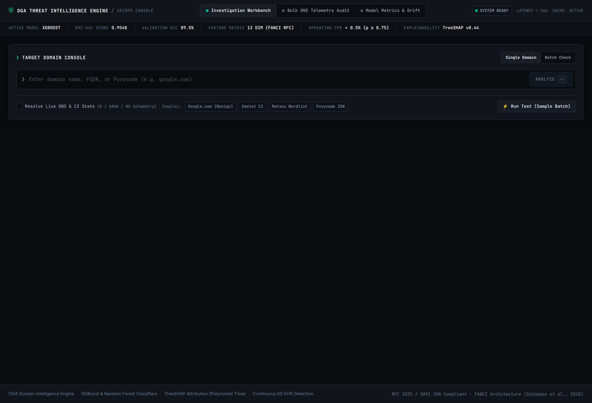
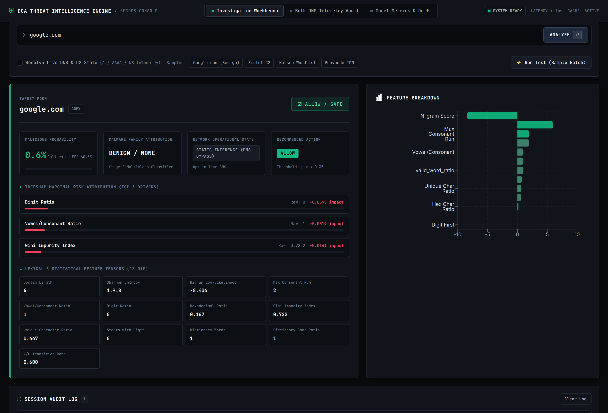
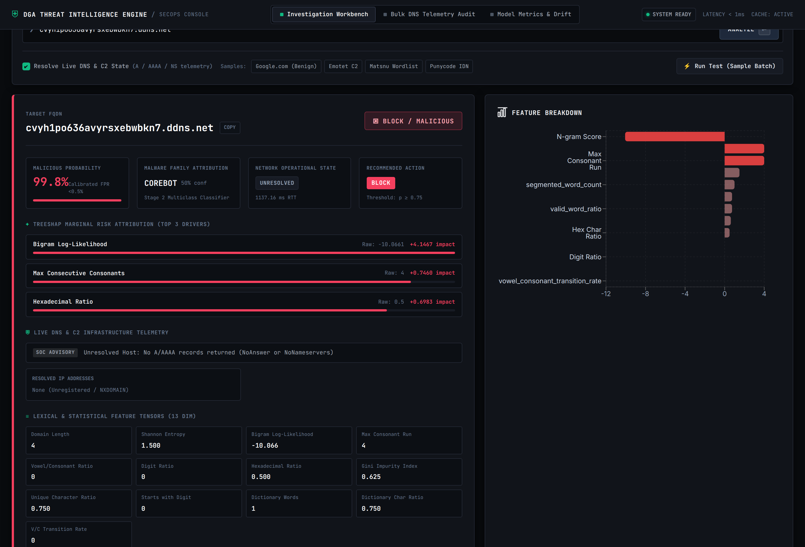
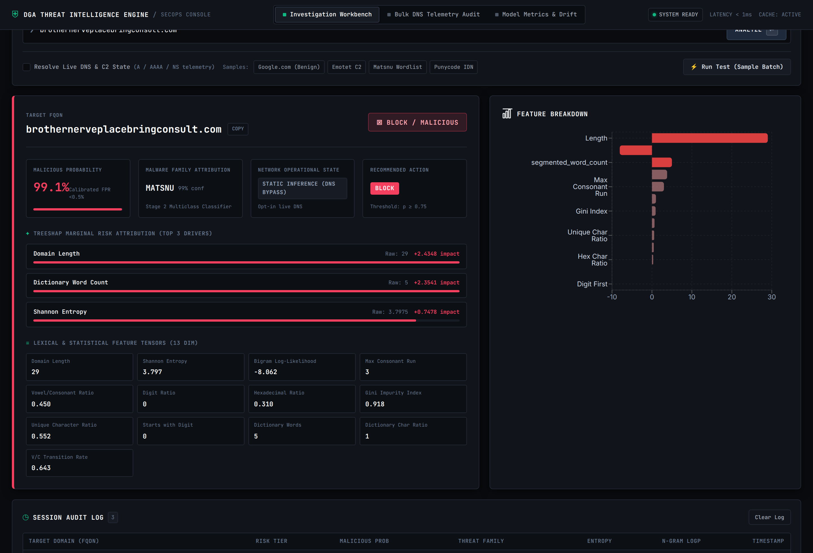
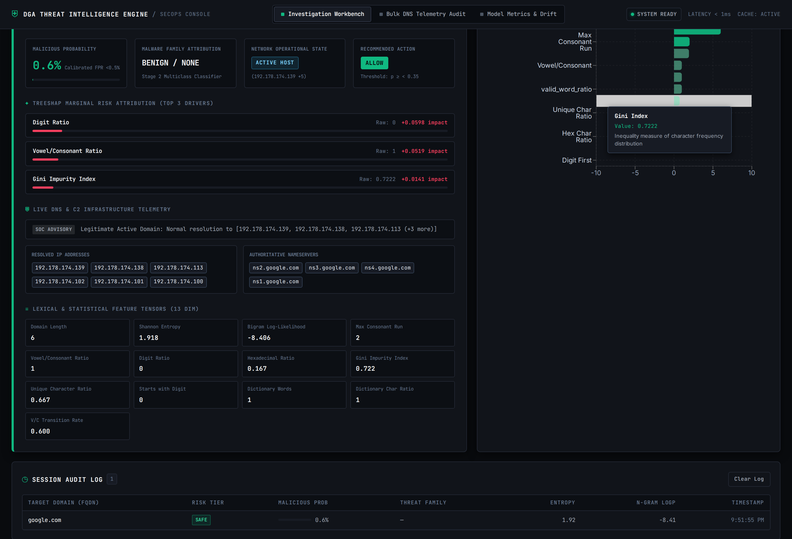
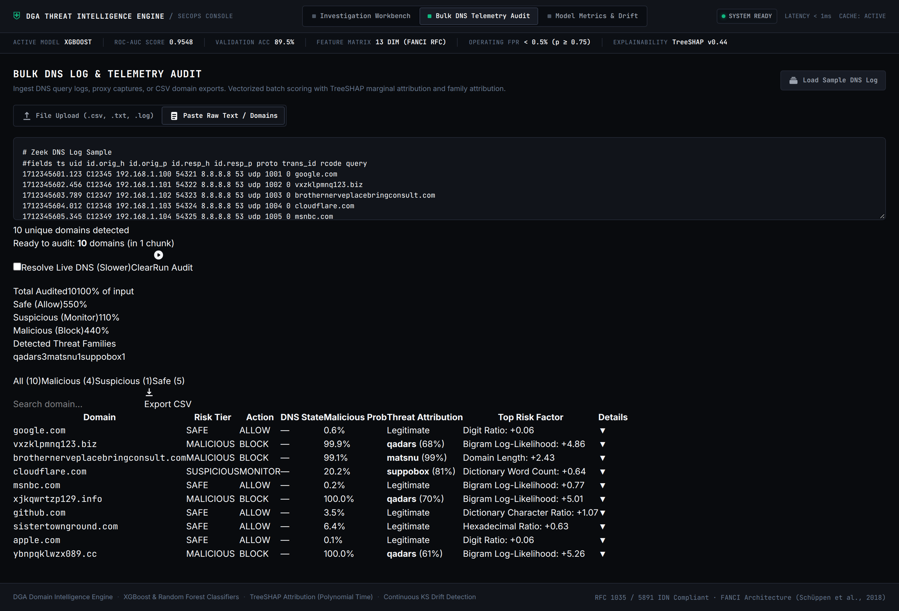
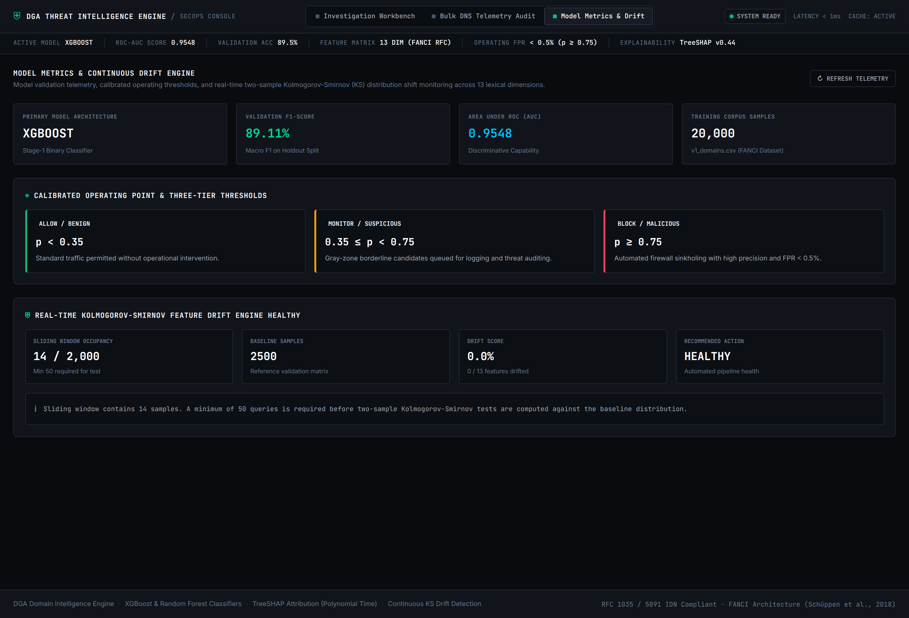
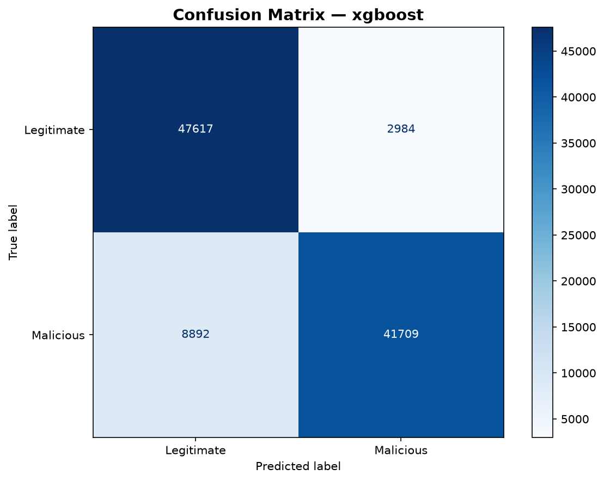
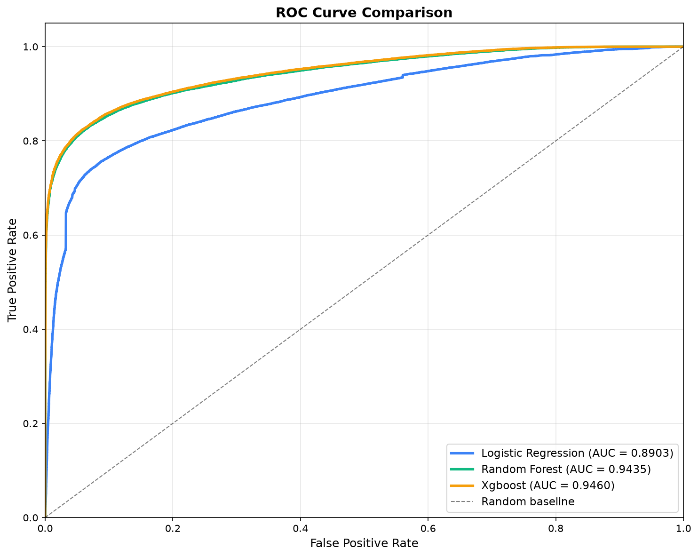
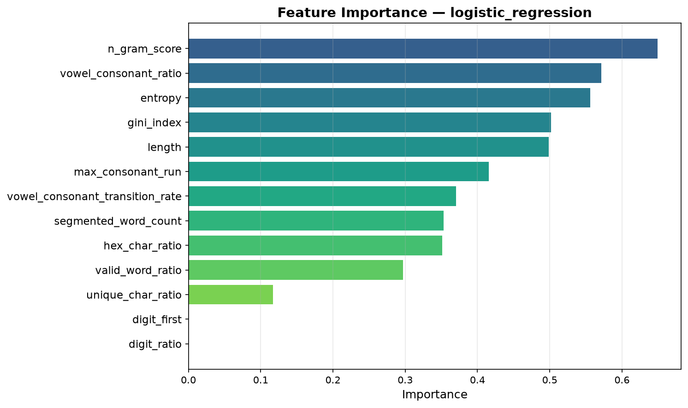

<p align="center">
  
  
  
  
  
  
  
  
</p>

# 🛡️ DGA Sentry

**A production-grade, full-stack machine learning system that detects and classifies malicious domains generated by Domain Generation Algorithms (DGAs) in real time — with explainable AI, live DNS telemetry, and continuous model drift monitoring.**

> _DGA Sentry acts as a vigilant digital sentinel at the network perimeter, inspecting every domain against a two-stage cascaded ML pipeline to unmask botnet C2 communications before they reach their targets._

---

## 🎯 What Is a DGA and Why Does It Matter?

**Domain Generation Algorithms (DGAs)** are techniques used by modern malware families (botnets, ransomware, trojans) to dynamically generate thousands of pseudo-random domain names. Infected machines cycle through these domains to locate their Command & Control (C2) servers, making traditional IP/domain blocklists ineffective.

DGA Sentry solves this by analyzing the **lexical structure** of any domain string in sub-millisecond latency — identifying algorithmically generated patterns that human-registered domains don't exhibit.

---

## 📸 Screenshots

<table>
  <tr>
    <td align="center"><b>🔬 SOC Investigation Workbench</b></td>
    <td align="center"><b>✅ Benign Domain Analysis</b></td>
  </tr>
  <tr>
    <td></td>
    <td></td>
  </tr>
  <tr>
    <td align="center"><b>🚨 Malicious DGA Detection</b></td>
    <td align="center"><b>📖 Wordlist DGA Detection</b></td>
  </tr>
  <tr>
    <td></td>
    <td></td>
  </tr>
  <tr>
    <td align="center"><b>🌐 Live DNS & C2 Telemetry</b></td>
    <td align="center"><b>📊 Bulk DNS Log Audit</b></td>
  </tr>
  <tr>
    <td></td>
    <td></td>
  </tr>
  <tr>
    <td colspan="2" align="center"><b>📈 Model Metrics & Drift Dashboard</b></td>
  </tr>
  <tr>
    <td colspan="2" align="center"></td>
  </tr>
</table>

---

## 🏗️ System Architecture

<p align="center">
  
</p>

<details>
<summary><b>🔎 Architecture at a Glance</b></summary>

<br/>

The system follows a **two-stage cascaded ML pipeline** with full-stack serving:

1. **API Ingress Gateway** — FastAPI with SlowAPI rate limiting (120 req/min/IP), RFC 1035/5891 hostname validation, IDN Punycode decoding, and a thread-safe LRU prediction cache (10K entries, <100µs cache hit)

2. **13-D Lexical Feature Extractor** — Extracts Shannon entropy, Gini index, character distribution ratios, Laplace-smoothed bigram log-likelihood, WordNinja segmentation, vowel/consonant transition rates, and more — all in <0.15ms

3. **Stage 1: Calibrated XGBoost Binary Classifier** — 300 gradient boosted trees evaluate the scaled 13-D feature vector. Outputs calibrated posterior probability P(malicious|x) for three-tier risk disposition

4. **Stage 2: Random Forest Threat Attributor** — Triggered only for non-safe domains (P ≥ 0.35). Attributes across **25 DGA botnet families** (Emotet, Conficker, Gozi, Mirai, Suppobox, Matsnu, etc.)

5. **Explainable AI (TreeSHAP)** — Native C++ booster computes exact game-theoretic Shapley values in <0.2ms, extracting the top-3 risk drivers for SOC analyst auditability

6. **Live DNS Telemetry** (opt-in) — Async dnspython resolver queries Cloudflare/Google DNS to classify domains as Active C2 vs Dormant NXDOMAIN

7. **Statistical Drift Monitor** — Real-time two-sample Kolmogorov-Smirnov test on a 2,000-sample sliding window to detect adversarial concept drift

8. **React 19 SOC Console** — Investigation workbench, bulk DNS log audit with CSV export, and model metrics dashboard

</details>

---

## 📊 Model Performance

### Validation Set Results

| Model | Accuracy | Precision | Recall | F1-Score | ROC-AUC |
|:------|:--------:|:---------:|:------:|:--------:|:-------:|
| Logistic Regression | 0.8301 | 0.8656 | 0.7816 | 0.8215 | 0.8896 |
| Random Forest | 0.8804 | 0.9322 | 0.8204 | 0.8727 | 0.9430 |
| **XGBoost** ★ | **0.8828** | **0.9344** | **0.8234** | **0.8754** | **0.9454** |

### Test Set Results (Best Model — XGBoost)

| Metric | Score |
|:-------|:-----:|
| Accuracy | 0.8827 |
| Precision | 0.9332 |
| Recall | 0.8243 |
| F1-Score | 0.8754 |

> The best model is selected by **F1-score** on the validation set and saved for API serving. The close alignment between validation and test scores confirms **no overfitting**.

### Evaluation Plots

<table>
  <tr>
    <td align="center"><b>Confusion Matrix</b></td>
    <td align="center"><b>ROC Curve Comparison</b></td>
    <td align="center"><b>Feature Importance</b></td>
  </tr>
  <tr>
    <td></td>
    <td></td>
    <td></td>
  </tr>
</table>

---

## ✨ Key Features

| Feature | Description |
|:--------|:------------|
| **Two-Stage Cascaded ML** | XGBoost binary classifier → Random Forest 25-family attributor |
| **13 Lexical Features** | Shannon entropy, bigram log-likelihood, Gini index, hex ratio, WordNinja segmentation, consonant runs, and more |
| **Explainable AI** | TreeSHAP top-3 risk factor attribution for every prediction |
| **Three-Tier Risk Scoring** | Safe (P < 0.35) · Suspicious (0.35 ≤ P < 0.75) · Malicious (P ≥ 0.75) |
| **Live DNS Telemetry** | Async C2 infrastructure state resolution (Active Host vs NXDOMAIN) |
| **Sub-Millisecond Inference** | LRU cache hits in <100µs, full pipeline in <1ms |
| **Concept Drift Detection** | Real-time Kolmogorov-Smirnov statistical test on sliding feature window |
| **Bulk DNS Log Audit** | Upload Zeek/CSV/TXT logs for batch SIEM-grade analysis with CSV export |
| **SOC Console UI** | Cybersecurity-themed React dashboard with interactive feature breakdowns |
| **RFC Compliant** | RFC 1035 / 5891 IDN Punycode domain validation |
| **Fully Containerized** | Docker Compose for one-command deployment |

---

## 🧬 Feature Engineering

The lexical feature set is grounded in published DGA detection research, primarily:

> **Schüppen, S., Teuber, D., Herrmann, P., & Meyer, U. (2018).**
> _"FANCI: Feature-based Automated NXDomain Classification and Intelligence."_
> USENIX Security Symposium.

| Category | Features | Rationale |
|:---------|:---------|:----------|
| **Statistical** | Shannon entropy, Gini impurity index, unique character ratio | DGA domains exhibit higher randomness than human-registered domains |
| **N-Gram Language Model** | Laplace-smoothed character bigram log-likelihood | Algorithmic domains produce character pairs rarely seen in natural language |
| **Structural** | Domain length, digit ratio, hexadecimal character ratio, starts-with-digit | Many DGA families use hex strings or numeric prefixes |
| **Phonetic** | Vowel/consonant ratio, max consecutive consonants, V/C transition rate | Human-readable domains follow natural phonetic patterns |
| **Linguistic** | WordNinja dictionary word count, dictionary character ratio | Word-based DGAs concatenate dictionary words differently than real domains |

---

## 📦 Data Sources

This project uses **openly reproducible, publicly accessible** data sources:

| Source | Type | Size | Link |
|:-------|:-----|:-----|:-----|
| **chrmor/DGA_domains_dataset** | DGA malicious + Alexa benign | ~675K domains, 25 DGA families | [GitHub](https://github.com/chrmor/DGA_domains_dataset) |
| **Tranco Top 1M** *(supplement)* | Benign domains | 1M ranked domains | [tranco-list.eu](https://tranco-list.eu) |

> **Fully reproducible from public data** — no private datasets, university-restricted downloads, or signup-gated APIs.

---

## 🚀 Quick Start

### Option 1: Docker (Recommended)

```bash
git clone https://github.com/aniprogramer/dga-sentry.git
cd dga-sentry
docker-compose up
```

| Service | URL |
|:--------|:----|
| Frontend | http://localhost:3100 |
| API Docs | http://localhost:9000/docs |

### Option 2: Local Development

**Backend:**
```bash
cd backend
python -m venv venv && source venv/bin/activate
pip install -r requirements.txt

# 1. Prepare data
python -m backend.src.data_prep

# 2. Train models (logs to MLflow)
python -m backend.src.train

# 3. Generate evaluation plots
python -m backend.src.evaluate

# 4. Start API server
uvicorn backend.src.api.main:app --reload --port 9000
```

**Frontend:**
```bash
cd frontend
npm install
echo "VITE_API_URL=http://localhost:9000" > .env
npm run dev
```

**View MLflow Experiments:**
```bash
cd backend
mlflow ui --backend-store-uri sqlite:///mlruns/mlflow.db --default-artifact-root ./mlruns/artifacts --port 5000
# Open http://localhost:5000
```

---

## 🛠️ Tech Stack

| Layer | Technology |
|:------|:-----------|
| **ML / Data** | Python 3.11 · pandas · NumPy · scikit-learn · XGBoost · tldextract · WordNinja |
| **Explainability** | TreeSHAP (native C++ booster) |
| **Experiment Tracking** | MLflow |
| **Backend API** | FastAPI · Pydantic · Uvicorn · SlowAPI · dnspython |
| **Frontend** | React 19 · TypeScript · Vite 6 · Tailwind CSS v4 · Recharts |
| **Containerization** | Docker · Docker Compose |
| **CI/CD** | GitHub Actions (lint + test + build) |
| **Testing** | pytest (backend) · Vitest (frontend) |

---

## 📁 Project Structure

```
dga-sentry/
├── backend/
│   ├── src/
│   │   ├── data_prep.py              # Data acquisition & preprocessing
│   │   ├── features.py               # 13-D lexical feature extraction (FANCI-based)
│   │   ├── train.py                  # Multi-model training with MLflow tracking
│   │   ├── evaluate.py               # Evaluation plots & metrics generation
│   │   └── api/
│   │       ├── main.py               # FastAPI serving layer with cascaded ML pipeline
│   │       ├── cache.py              # Thread-safe LRU prediction cache
│   │       ├── dns_resolver.py       # Async live DNS & C2 telemetry resolver
│   │       └── drift_detector.py     # Kolmogorov-Smirnov concept drift monitor
│   ├── data/                         # Raw + processed datasets
│   ├── models/                       # Saved model artifacts (.joblib)
│   ├── outputs/plots/                # Evaluation visualizations
│   ├── tests/                        # pytest test suite
│   ├── Dockerfile
│   └── requirements.txt
├── frontend/
│   ├── src/
│   │   ├── App.tsx                   # Main application with tab navigation
│   │   ├── components/
│   │   │   ├── DomainInput.tsx       # Domain input console with sample domains
│   │   │   ├── PredictionResult.tsx  # Rich prediction display with SHAP & DNS
│   │   │   ├── ConfidenceChart.tsx   # Interactive feature breakdown chart
│   │   │   ├── BulkAudit.tsx         # Bulk DNS log audit with CSV export
│   │   │   ├── ModelMetricsDrift.tsx  # Model metrics & drift monitoring dashboard
│   │   │   ├── HistoryTable.tsx      # Session audit log
│   │   │   └── QuickTestResults.tsx  # Sample batch test results
│   │   └── api/client.ts            # Typed API client
│   ├── tests/                        # Vitest component tests
│   ├── Dockerfile
│   └── package.json
├── docs/
│   ├── figures/                      # Architecture diagram & UI screenshots
│   └── report.tex                    # Academic capstone report (LaTeX)
├── test/
│   └── dga_simulation.py            # DGA family simulation for testing
├── .github/workflows/               # CI pipeline (lint + test + build)
├── docker-compose.yml
├── ARCHITECTURE.md                   # Detailed design decisions & trade-offs
├── EVALUATION.md                     # Model evaluation analysis
└── README.md
```

---

## 🧠 Design Decisions

<details>
<summary><b>Why Classical ML Over Deep Learning?</b></summary>

<br/>

- **Explainability** — Feature-engineered models let us show _why_ a domain is flagged (high entropy, unusual bigrams, long consonant runs). Security analysts need to understand alerts, not just receive them.
- **Inference Speed** — Feature extraction + tree prediction runs in <1ms. Character-level neural models add 10–100× latency for marginal accuracy gains on this task.
- **Training Cost** — Full pipeline trains in under 15 minutes on a single CPU. No GPU required. Anyone can reproduce from scratch.
- **Proven Effectiveness** — Lexical feature approaches achieve >95% F1 on DGA detection benchmarks (Schüppen et al., 2018).

</details>

<details>
<summary><b>Why React Over Streamlit/Gradio?</b></summary>

<br/>

- **Full-Stack Demonstration** — Component architecture, TypeScript type safety, responsive design, and modern build tooling.
- **UX Control** — Cybersecurity-themed UI with glassmorphism, animated confidence bars, and feature breakdown charts impossible in Streamlit.
- **Deployment Independence** — Static bundle deploys to any CDN, completely independent of the Python backend.
- **Production Realism** — Real ML products use API-first architectures with decoupled frontends, not notebook-style UIs.

</details>

---

## 🔮 Future Improvements

- **Model Monitoring & Drift Detection** — Track prediction distributions over time with automated alerting
- **Automated Retraining Pipeline** — Periodic ingestion of fresh DGA feeds (Netlab 360, Bambenek) with MLflow model registry
- **Expanded DGA Coverage** — Beyond 25 families to cover newer malware strains and adversarial DGA samples
- **Character-Level Deep Learning** — Compare CNN/LSTM baselines against the feature-engineered approach
- **Authentication & Rate Limiting** — Production API key auth and request throttling
- **DNS Query Context** — WHOIS lookup age, registration patterns, and query frequency as supplementary features
- **A/B Testing Framework** — Serve multiple model versions simultaneously and compare live performance

---

## 📄 License

This project is licensed under the [MIT License](LICENSE).

---

## 📚 References & Acknowledgements

- Schüppen, S., Teuber, D., Herrmann, P., & Meyer, U. (2018). *"FANCI: Feature-based Automated NXDomain Classification and Intelligence."* USENIX Security Symposium. — The foundational research behind the lexical feature engineering approach used in this project.
- [chrmor/DGA_domains_dataset](https://github.com/chrmor/DGA_domains_dataset) — Open-source DGA domain corpus covering 25 malware families.
- [Tranco Top 1M](https://tranco-list.eu) — Research-grade popularity ranking used for benign domain sampling.
